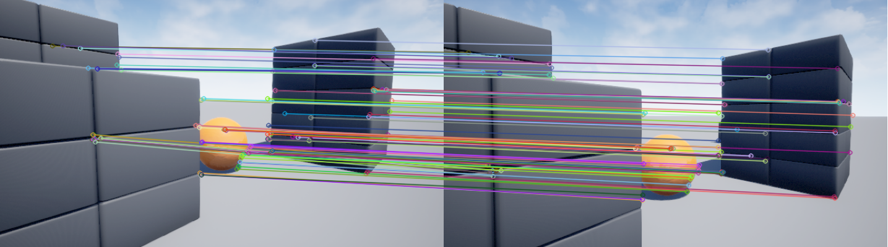

# ORB-Feature-Matching
An implementation of ORB feature matching with image pair from AirSim. 




## How it works

The script performs a multi-stage process to find reliable matches:

1. **Detect**  
   Finds up to 2000 ORB keypoints and descriptors in both images.

2. **Match**  
   Uses a k-Nearest Neighbor (k=2) Brute-Force matcher with `cv2.NORM_HAMMING` distance.

3. **Filter (Ratio Test)**  
   Applies Lowe's Ratio Test to keep only unambiguous matches (where the best match is significantly better than the second-best).

4. **Verify (RANSAC)**  
   Uses `cv2.findEssentialMat` with RANSAC. This step finds the set of **inlier** matches that are consistent with a single 3D camera motion, filtering out all remaining outliers.


## How to run

1. Clone the repo

```bash
git clone https://github.com/minhquyminhquy/ORB-Feature-Matching.git
cd ORB-Feature-Matching
```

2. Set up a Python virtual environment and install dependencies

```bash
python3 -m venv venv
source venv/bin/activate
pip install -r requirements.txt
```

3. Run the script: Pass in two image paths as arguments. Example images are provided in the /example_imgs directory.

```bash
python3 main.py example_imgs/airsim_blocks_img1.png example_imgs/airsim_blocks_img2.png
```